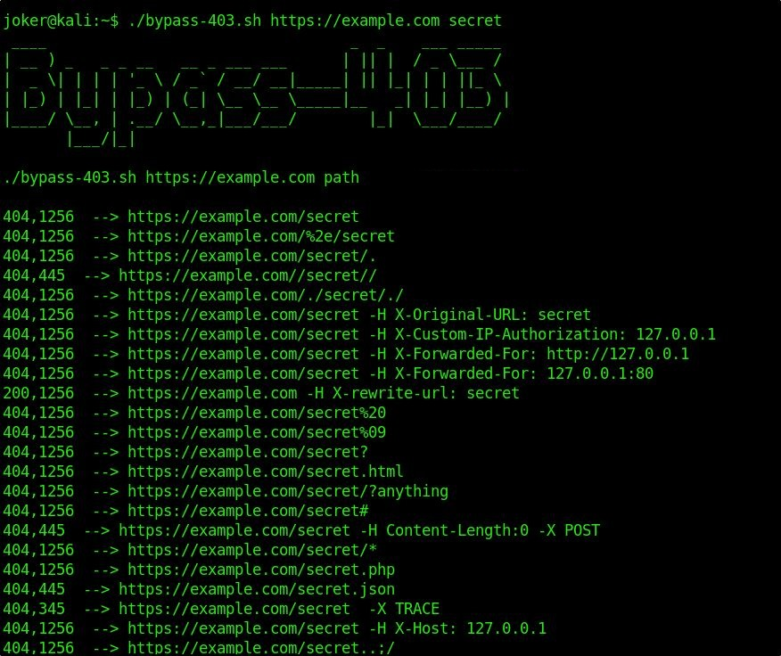

# Bypass-403
- A simple script just made for self use for bypassing 403
- It can also be used to compare responses on verious conditions as shown in the below snap

# Usage
`./Bypass-403.sh https://example.com admin`

`./Bypass-403.sh website-here path-here`

# Features
- Use 24 known Bypasses for 403 with the help of curl

# Installation
   * `git clone https://github.com/LiZ4rDTeam/Bypass-403`
   * `cd Bypass-403`
   * `chmod +x Bypass-403.sh`
   * `sudo apt install figlet`  - If you are unable to see the logo as in the screenshot
   * `sudo apt install jq`      - If you don't have jq installed on your machine
   